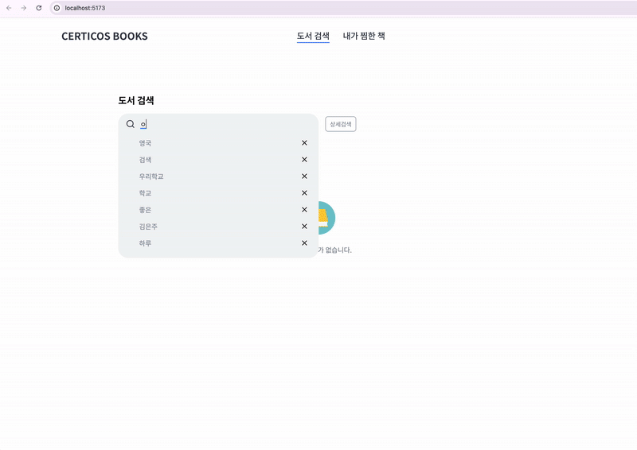
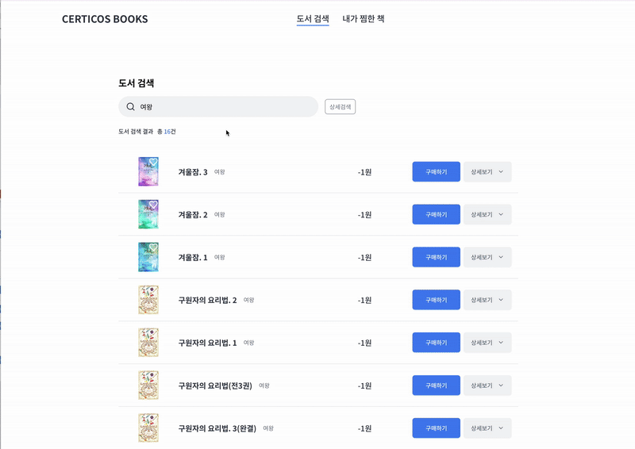
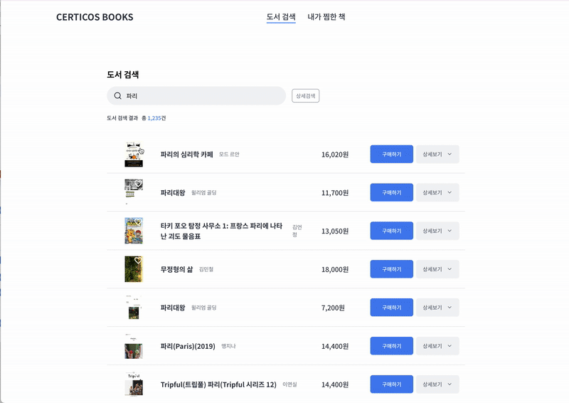

# 📚 Book Finder

**책 검색 기능을 중심으로 한 도서 탐색 웹 애플리케이션입니다.**  
카카오 책 검색 API를 활용하여 실시간 도서 검색, 검색 기록 저장, 무한 스크롤, 상세 필터 등의 기능을 제공합니다.

---

## 🧩 프로젝트 개요

사용자는 검색창에 키워드를 입력하여 도서를 검색할 수 있으며,  
검색 기록은 최근 8개까지 저장되어 다시 쉽게 검색할 수 있습니다.  
또한, 검색 대상(제목, 저자명, 출판사, ISBN)을 선택하여 보다 정교한 검색이 가능합니다.

> ✅ **주요 기술 스택**: React, TypeScript, Zustand, React Query, ShadcnUI, Tailwind CSS

---

## ⚙️ 실행 방법 및 환경 설정

```bash
# 1. 저장소 클론
git clone https://github.com/hyeon-chae/cdri-books-chae-hyeon.git

# 2. 의존성 설치
cd cdri-books-chae-hyeon
npm install

# 3. 환경 변수 설정
cp .env.local

# 4. 개발 서버 실행
npm run dev

## 폴더 구조 및 주요 코드 설명
📦 root
├── 📁 src/                     # 실제 애플리케이션 코드
│   ├── 📁 components/          # 재사용 가능한 공통 UI 컴포넌트
│   │   ├── 📁 ui               # 버튼, 입력창, 페이지네이션 등 UI 단위 컴포넌트
│   │   ├── BookDetailItem.tsx
│   │   ├── BookItemToggle.tsx  # 도서 아이템을 목록과 상세로 보여주는 토글 카드 UI
│   │   ├── BookListItem.tsx
│   │   ├── Empty.tsx
│   │   ├── Header.tsx
│   │   ├── PaginationWrapper.tsx # Shadcn 기반 페이지네이션 컴포넌트
│   │   └── SearchInput.tsx     # 검색창 + 검색 기록 드롭다운 + 검색 핉터
│
│   ├── 📁 hooks/               # 커스텀 훅 모음
│   │   ├── useClickOutside.ts  # 외부 클릭 감지 hook
│   │   ├── useInfiniteScroll.ts
│   │   ├── usePagination.ts
│   │   └── useSearchBooks.ts   # 검색 관련 react-query hook
│
│   ├── 📁 lib/                 # 유틸리티 함수 및 API 관련 로직
│   │   ├── 📁 api/             # API 호출 함수
│   │   │   ├── common.ts
│   │   │   └── search.ts
│   │   ├── 📁 types/           # 타입 선언
│   │   │   └── search.ts
│   │   └── utils.ts            # 유틸 함수 및 상수
│
│   ├── 📁 pages/               # 라우팅 페이지 (기능별로 분리)
│   │   └── 📁 home/            # 홈 관련 페이지 컴포넌트
│   │       ├── FavoritesContents.tsx
│   │       ├── index.tsx
│   │       └── SearchContents.tsx # 검색 결과 리스트 및 스크롤 기능 포함
│
│   ├── 📁 routes/                # 라우터 설정 파일
│   │   └── index.tsx
│
│   ├── 📁 stores/                # Zustand 상태 관리 저장소
│   │   ├── bookmarkStore.ts      # 찜하기 상태 관리
│   │   └── searchHistoryStore.ts # 검색 히스토리 관리
│
│   ├── App.tsx                   # 앱의 진입 컴포넌트
│   ├── index.css                 # 글로벌 스타일
│   └── main.tsx                  # Vite 엔트리 파일


## 사용된 주요 라이브러리 및 선택 이유
- React Query:

## 강조하고 싶은 기능
### 🔍 1. 최근 검색어 기록 (Zustand + LocalStorage)
- Zustand 전역 상태를 통해 최근 검색 키워드 8개까지 저장, 오래된 순으로 자동 삭제
- 검색창 포커스 시 드롭다운 형태로 검색 기록 노출
- 키워드 클릭 시 해당 검색어로 즉시 재검색 가능
- 삭제 버튼으로 개별 삭제 가능

### 📖 2. 검색 필터 드롭다운
- 제목, 저자, 출판사, ISBN 선택 가능
- 선택된 필터 기준으로 API 호출
- 검색 필터와 입력값은 별도로 관리되어 유연한 검색 가능

### 📌 3. 글로벌 상태 기반 찜하기 기능
- bookmarkStore를 통해 사용자가 마음에 드는 책을 찜 가능
- 각 도서 카드에 토글 버튼 제공 (찜/찜 해제)
- 상태는 전역에서 공유되며 FavoritesContents.tsx에 찜 목록만 필터링하여 렌더링
- 페이지 전환 시에도 찜 상태 유지

### ♾️ 4. 무한 스크롤
- 검색 목록 Intersection Observer 기반, 사용자가 스크롤 시 다음 페이지 자동 로딩
- react-query를 활용해 효율적인 페이지 캐싱 및 요청 중복 방지
- 사용자 조작 없이 자연스러운 결과 로딩 경험 제공

### 💾 5. 상태 및 UX 최적화
- 쿼리 중복 방지, 창 포커스/네트워크 복원 시 불필요한 리패치 방지
- 검색 시 입력창 자동 블러 처리

## 미리보기
### 검색


### 검색


### 검색



## 향후 개선 포인트
- Skeleton UI 및 로딩 스피너 추가
- 검색 바 필터 재사용가능 하도록 분리
```
